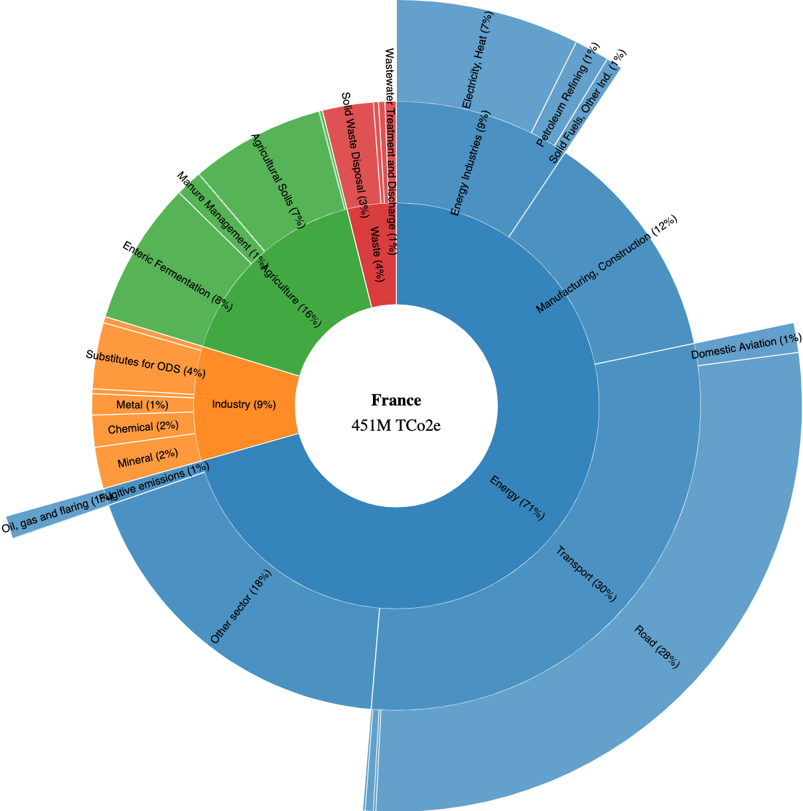
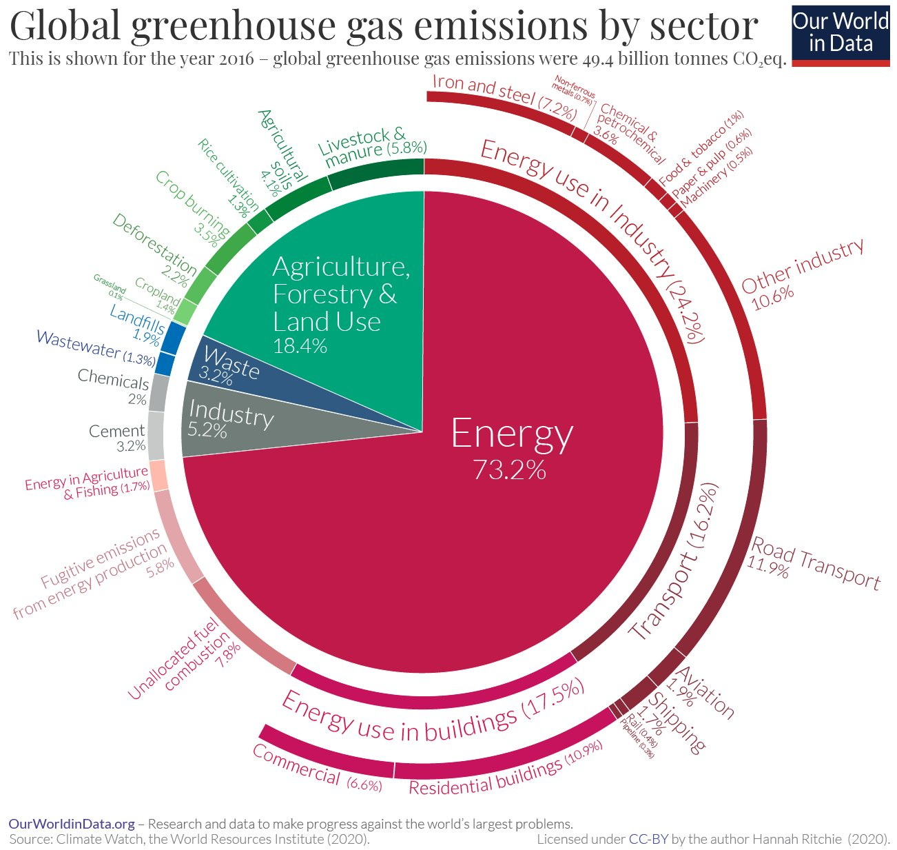

# Greenhouse Gas Emissions by Country and Sector



### Background 

As many I am a fan of [Our World in Data](https://ourworldindata.org/ghg-emissions-by-sector) work. One visualization I found particularly interesting was the one from [Hannah Ritchie](https://twitter.com/_HannahRitchie) on mapping global GHG emissions by sector and sub-sector. 



What I found striking is the size of energy (~73% of GHG emissions) and the ability to quickly compare across countries. For instance Iron and Steel production (~7%) is 3.7x greater than aviation emissions (~1.9%)! 

But what does it look like at the country level? I have asked Hannah on [Twitter](https://twitter.com/martindaniel4/status/1309437056008040450) and unfortunately the data is not easily available. 

### Data 

One pointer from [laydgeur](https://twitter.com/laydgeur/status/1310496254741434369) was to use the `Greenhouse gas inventory data by party` from the United Nations Climate Change secretariat. 

Using the [Flexible query](https://di.unfccc.int/flex_annex1) interface, it is possible to download a hierarchy sector GHG emissions by country for the last year reported (here 2018). Not all countries have the same level of data but it's a great start. That csv is available in the `data/emissions.csv` folder. 


Here is a sample of the output. As you can see the subsectors are indicated with a level (1, 1.A, 1.A.1 etc..) which will come handy for our visualization. 

Country|Category|emissions
---|---|---
Australia|1.  Energy|435570.94
Australia|1.AA  Fuel Combustion - Sectoral approach|381121.1
Australia|1.A.1  Energy Industries|213835.41
Australia|1.A.1.a  Public Electricity and Heat Production|183170.46
Australia|1.A.1.b  Petroleum Refining|3078.61
Australia|1.A.1.c  Manufacture of Solid Fuels and Other Energy Industries|27586.35

Not all categories match unfortunately. For instance the category `Public Electricity and Heat Production` would be allocated to "energy used in buildings" in Hannah's graph. 

### Methodology 

- Country emissions do not include the `Land Use, Land-Use Change and Forestry (LULUCF)` values which can have negative values (as a forest can trap GHG emissions). That total value at the country level is available from the UN site as `GHG total without LULUCF, in kt CO₂ equivalent`
- Sector definitions are available on the United Nations interface - https://di.unfccc.int/flex_annex1
- Numbers are reported in `Tons of CO₂ equivalent`. 
- I have simplified the categorization of emissions using the `data/mapping.csv` table. 

### Usage 

- Install dependencies: 

```python
pip install -r requirements.txt
```

- Run in terminal: 

```python
python data_cleaning.py
```